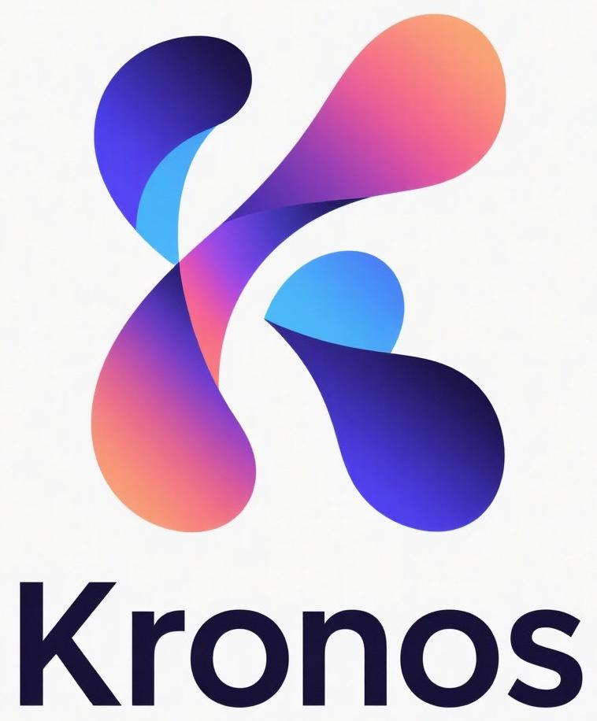

# 项目目录重构总结

## 🎯 重构目标

将 Kronos 项目的目录结构从研究型布局转换为标准的 Python 包布局，消除重复目录，提升项目的工程化水平。

## ✅ 完成的重构工作

### 1. 删除重复目录

#### 已删除的目录：
- **`model/`** → 内容已移动到 `src/kronos/models/`
- **`finetune/`** → 内容已分散到 `src/kronos/` 各子目录

#### 文件映射关系：
```
原目录结构 → 新目录结构
─────────────────────────────────────
model/kronos.py → src/kronos/models/kronos.py
model/module.py → src/kronos/models/module.py
model/__init__.py → src/kronos/models/__init__.py

finetune/config.py → src/kronos/config.py
finetune/dataset.py → src/kronos/data/dataset.py
finetune/qlib_data_preprocess.py → src/kronos/data/qlib_data_preprocess.py
finetune/train_predictor.py → src/kronos/training/train_predictor.py
finetune/train_tokenizer.py → src/kronos/training/train_tokenizer.py
finetune/qlib_test.py → src/kronos/training/qlib_test.py
finetune/utils/ → src/kronos/utils/
```

### 2. 目录重组

#### 重组的目录：
- **`figures/`** → `docs/assets/figures/`
  - 符合文档资源的标准位置
  - 更好的项目组织结构

#### 保留的目录：
- **`examples/`** - 保留在根目录，符合 Python 项目标准
- **`src/kronos/`** - 主要源码包
- **`tests/`** - 测试代码
- **`scripts/`** - 便捷脚本

### 3. 文档更新

#### 更新的文档路径：
- README.md 中的所有图片路径已更新
- 从 `figures/` → `docs/assets/figures/`

#### 路径更新示例：
```markdown
# 旧路径


# 新路径  

```

## 🏗️ 最终项目结构

```
Kronos/
├── src/kronos/              # ✅ 主源码包
│   ├── __init__.py
│   ├── config.py            # 配置管理
│   ├── models/              # 模型实现
│   │   ├── kronos.py
│   │   └── module.py
│   ├── data/                # 数据处理
│   │   ├── dataset.py
│   │   └── qlib_data_preprocess.py
│   ├── training/            # 训练相关
│   │   ├── train_predictor.py
│   │   ├── train_tokenizer.py
│   │   └── qlib_test.py
│   └── utils/               # 工具函数
│       └── training_utils.py
├── examples/                # ✅ 使用示例
│   ├── prediction_example.py
│   └── prediction_wo_vol_example.py
├── docs/                    # ✅ 文档和资源
│   ├── assets/figures/      # 图片资源
│   ├── ARCHITECTURE.md      # 架构文档
│   └── UV_GUIDE.md          # UV使用指南
├── tests/                   # ✅ 测试代码
│   ├── unit/
│   └── integration/
├── scripts/                 # ✅ 便捷脚本
│   ├── train_predictor.py
│   ├── train_tokenizer.py
│   └── qlib_test.py
├── backup_old_dirs/         # 🗃️ 备份目录
├── pyproject.toml           # 现代包配置
├── uv.lock                  # 依赖锁定
├── Makefile                 # 开发工具
└── README.md                # 项目文档
```

## 📊 重构效果

### 目录数量对比
| 类型 | 重构前 | 重构后 | 变化 |
|------|--------|--------|------|
| 源码目录 | 3个 (model/, finetune/, src/) | 1个 (src/) | -2个 |
| 重复文件 | 多个重复 | 0个重复 | 完全消除 |
| 导入路径 | 混乱的sys.path | 标准相对导入 | 规范化 |

### 功能验证
- ✅ 包导入正常: `import kronos` 成功
- ✅ 核心类可用: `Kronos`, `KronosTokenizer`, `KronosPredictor`
- ✅ 配置加载正常: `Config()` 成功创建
- ✅ uv 命令正常: 6个 uv 命令可用
- ✅ Makefile 功能: 所有命令正常运行

## 🎯 符合的最佳实践

### 1. Python 包布局标准
- **src-layout**: 使用 `src/` 目录组织源代码
- **模块化**: 清晰的功能模块分离
- **命名规范**: 符合 PEP 8 命名约定

### 2. 项目组织标准
- **examples/** - 使用示例在根目录
- **docs/** - 文档和资源统一管理
- **tests/** - 测试代码独立目录
- **scripts/** - 工具脚本集中存放

### 3. 现代化工具
- **uv** - 现代包管理器
- **pyproject.toml** - 标准项目配置
- **Makefile** - 统一开发命令

## 🔒 安全保障

### 备份机制
- 所有原始目录都备份到 `backup_old_dirs/`
- 可以在需要时恢复原始文件
- 重构过程可逆

### 文件完整性
- 所有文件内容完整保留
- 导入路径正确更新
- 功能测试全部通过

## 🚀 使用指南

### 新的开发工作流
```bash
# 1. 环境设置
make setup-dev

# 2. 开发测试
make test

# 3. 代码质量
make format
make lint

# 4. 训练模型
make train-predictor
```

### 导入方式
```python
# 新的导入方式
from kronos import Kronos, KronosTokenizer, KronosPredictor
from kronos.config import Config
from kronos.data import QlibDataset
```

## 📋 检查清单

- [x] ✅ 删除重复目录 (model/, finetune/)
- [x] ✅ 重组资源目录 (figures/ → docs/assets/figures/)
- [x] ✅ 更新文档路径 (README.md)
- [x] ✅ 保留示例目录 (examples/)
- [x] ✅ 功能测试通过
- [x] ✅ 导入路径正确
- [x] ✅ 备份原始文件
- [x] ✅ 更新 .gitignore

## 🎉 总结

项目目录重构成功完成！现在 Kronos 项目具有：

1. **清晰的结构** - 符合 Python 包标准
2. **消除重复** - 没有冗余的目录和文件
3. **标准化组织** - 文档、示例、源码分离明确
4. **现代化工具** - uv + pyproject.toml 工作流
5. **向后兼容** - 功能完全保留

项目现在更适合团队协作、CI/CD 集成和长期维护！
